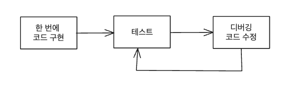
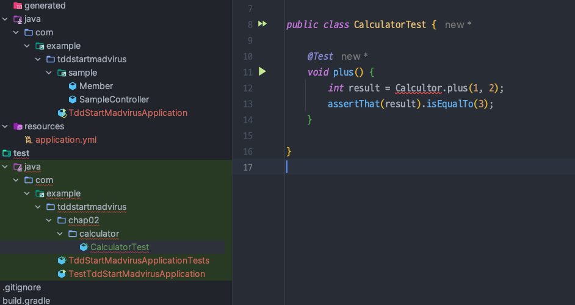
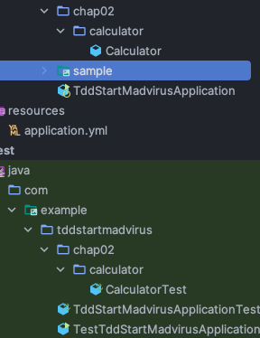

<!-- TOC -->
* [1. TDD 이전의 개발](#1-tdd-이전의-개발)
* [2. TDD란?](#2-tdd란)
  * [TDD 진행 방법](#tdd-진행-방법)
  * [TDD 연습: Calculator](#tdd-연습-calculator)
    * [테스트 먼저 만들기](#테스트-먼저-만들기)
    * [컴파일 에러 없애기](#컴파일-에러-없애기)
    * [테스트를 통과시키는 가장 쉬운 방법](#테스트를-통과시키는-가장-쉬운-방법)
    * [검증용 경우의 수 하나 더 추가](#검증용-경우의-수-하나-더-추가)
    * [테스트 통과 시키기 위해 구현 수정](#테스트-통과-시키기-위해-구현-수정)
    * [배포 대상에 포함시키기: 프로덕션 코드로 옮기기](#배포-대상에-포함시키기-프로덕션-코드로-옮기기)
  * [지금까지 간단하게 계산기로 연습해본 TDD 요약](#지금까지-간단하게-계산기로-연습해본-tdd-요약)
<!-- TOC -->

# 1. TDD 이전의 개발




(한 번에 구현하는 코드가 많을수록 디버깅할 때 스트레스가 높아진다.)

- TDD 덕분에 예전보다 더 나은 코드를 더 짧은 시간에 만들 수 있게 되었다.

---

# 2. TDD란?

## TDD 진행 방법

- TDD는 테스트부터 시작.
- 먼저 테스트를 하고 그다음에 구현.
  - 테스트를 먼저 한다는 것은, 기능이 올바르게 동작하는지 검증하는 테스트 코드를 작성한다는 것
- (1) **기능을 검증하는 테스트 코드를 먼저 작성**하고, (2) **테스트를 통과시키기 위해 개발을 진행**한다.

## TDD 연습: Calculator

### 테스트 먼저 만들기



- 테스트 클래스를 먼저 만든다.
- 인스턴스 메서드가 아닌 정적 메서드로 선언한 이유?
  - 현재는 덧셈 기능을 구현하기 위해 새로운 객체를 만들 필요가 없다.

### 컴파일 에러 없애기

```java
public class Calculator {

	public static int plus(int num1, int num2) {
		return 0;
	}

}
```

- 실행하면 당연히 실패한다. (결과값이 3이아니기 때문)

### 테스트를 통과시키는 가장 쉬운 방법

```java
public class Calculator {

	public static int plus(int num1, int num2) {
		return 3;
	}

}
```

- 위 테스트를 통과시키는 가장 쉬운 방법은 그냥 3을 바로 리턴하는 것이다.
- 여기서 num1 + num2 를 바로 리턴해도 되지만, 
  - 처음 ***TDD 입문할 때는 이런 작은 단계를 잘 밟아나가야 몸에 익히는게 수월하다.***

### 검증용 경우의 수 하나 더 추가

```java
@Test
void plus() {
    int result = Calculator.plus(1, 2);
    assertThat(result).isEqualTo(3);

    assertThat(Calculator.plus(1, 3)).isEqualTo(4); // 추가
}
```

- 이 경우의 수를 추가 했더니 테스트가 실패한다.

### 테스트 통과 시키기 위해 구현 수정

```java
public class Calculator {

	public static int plus(int num1, int num2) {
		if (num1 == 1 && num2 == 3) return 4; 
		
		return 3;
	}

}
```

- 구현 로직이 단순하지 않을 때는 이렇게 점진적으로 구현을 완성해나간다.

```java
public class Calculator {

	public static int plus(int num1, int num2) {
		return num1 + num2;
	}

}
```

- 현재 예는 단순하므로 바로 구현을 완료.

### 배포 대상에 포함시키기: 프로덕션 코드로 옮기기



- 코드 위치 이동한 뒤, 테스트를 다시 실행해서 테스트에 통과하는지 다시 확인한다.
- `src/test/java` 패키지는 배포 대상이 아니므로, 
  - 여기에 코드를 만들면 **완성되지 않은 코드가 배포되는 것을 방지**하는 효과가 있다.  

## 지금까지 간단하게 계산기로 연습해본 TDD 요약

1. 테스트 코드를 작성한 뒤 컴파일 오류를 없애는 데 필요한 클래스와 메서드를 작성.
2. 테스트를 바로 실행하고, 실패.
3. 단순히 3을 리턴해서 통과할 만큼만 구현
4. 실패한 테스트를 통과시켰고, **새로운 테스트를 추가**.
5. 다시 그 테스트를 통과시키기 위해 코드를 작성

👉 **_테스트를 작성하고 실패하면 통과시킬만큼의 코드를 추가하는 과정을 반복하면서 점진적으로 기능을 완성해나간다._**