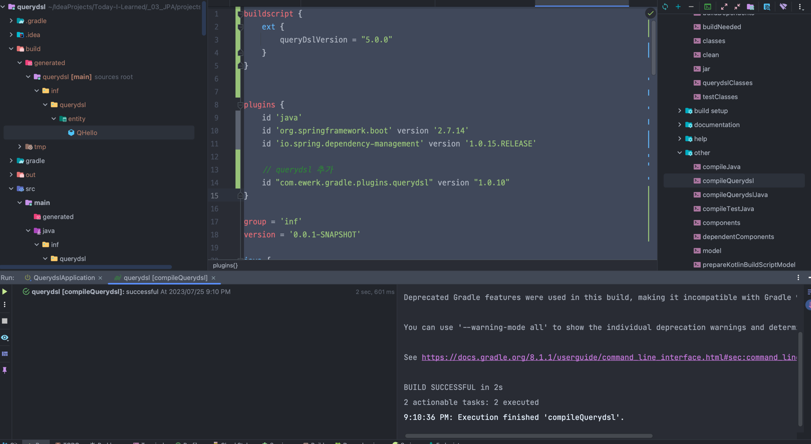

# 설정

## Unable to load class 'com.mysema.codegen.model.Type'. 문제

### 상황

- Querydsl 기초 세팅 후, gradle > other > compileQuerydsl 하니 다음과 같은 에러 발생


### 원인

- 스프링 부트 2.6, Gradle 5.0 이상일 시 적용방법이 달라짐

### 해결

```groovy
buildscript {
    ext {
        queryDslVersion = "5.0.0"
    }
}


plugins {
    id 'java'
    id 'org.springframework.boot' version '2.7.14'
    id 'io.spring.dependency-management' version '1.0.15.RELEASE'

    // querydsl 추가
    id "com.ewerk.gradle.plugins.querydsl" version "1.0.10"
}

group = 'inf'
version = '0.0.1-SNAPSHOT'

java {
    sourceCompatibility = '11'
}

configurations {
    compileOnly {
        extendsFrom annotationProcessor
    }
}

repositories {
    mavenCentral()
}

dependencies {
    // spring boot
    implementation 'org.springframework.boot:spring-boot-starter-data-jpa'
    implementation 'org.springframework.boot:spring-boot-starter-web'

    //querydsl 추가
    implementation "com.querydsl:querydsl-jpa:${queryDslVersion}"
    annotationProcessor "com.querydsl:querydsl-apt:${queryDslVersion}"

    // lombok
    compileOnly 'org.projectlombok:lombok'
    annotationProcessor 'org.projectlombok:lombok'

    // h2
    runtimeOnly 'com.h2database:h2'

    // test
    testImplementation 'org.springframework.boot:spring-boot-starter-test'
}

tasks.named('test') {
    useJUnitPlatform()
}

//querydsl 추가 시작
def querydslDir = "$buildDir/generated/querydsl"

querydsl {
    jpa = true
    querydslSourcesDir = querydslDir
}

sourceSets {
    main.java.srcDir querydslDir
}

configurations {
    querydsl.extendsFrom compileClasspath
}

compileQuerydsl {
    options.annotationProcessorPath = configurations.querydsl
}
//querydsl 추가 끝
```

- querydsl-jpa , querydsl-apt 를 추가하고 querydsl 버전을 명시해야 한다.



<br>

# 검증

### 테스트용 엔티티

```java
@Entity
@Getter
@Setter
public class Hello {

	@Id
	@GeneratedValue(strategy = GenerationType.IDENTITY)
	private Long id;

}
```

- `compileQuerydsl` 이후 다음과 같은 QType이 생성된다.

```java
package inf.querydsl.entity;

/**
 * QHello is a Querydsl query type for Hello
 */
@Generated("com.querydsl.codegen.DefaultEntitySerializer")
public class QHello extends EntityPathBase<Hello> {

    private static final long serialVersionUID = 1375731L;

    public static final QHello hello = new QHello("hello");

    public final NumberPath<Long> id = createNumber("id", Long.class);

    public QHello(String variable) {
        super(Hello.class, forVariable(variable));
    }

    public QHello(Path<? extends Hello> path) {
        super(path.getType(), path.getMetadata());
    }

    public QHello(PathMetadata metadata) {
        super(Hello.class, metadata);
    }

}
```

### 사용법 (테스트 코드)

```java
@Test
void contextLoads() {
    Hello hello = new Hello();
    em.persist(hello);

    JPAQueryFactory query = new JPAQueryFactory(em);
    QHello qHello = QHello.hello;

    Hello result = query
        .selectFrom(qHello)
        .fetchOne();

    assertThat(result).isEqualTo(hello);
    assertThat(result.getId()).isEqualTo(hello.getId());
}
```

