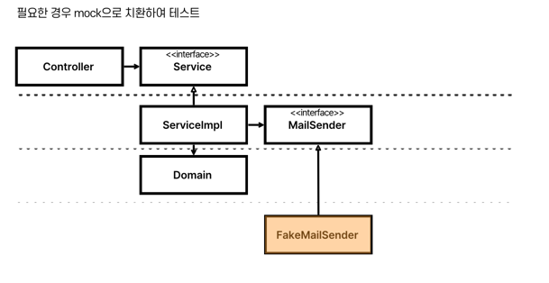

# 테스트의 범위

- 집중해야하는 것은 서비스와 도메인이다.

- 컨트롤러와 RepositoryImpl 은 테스트 해야하나 싶다.

- 스프링을 제대로 다뤘다면, 컨트롤러의 역할은 너무나 단순하다.
  1. 핸들러가 RequestBody 를 받아서,
  2. 서비스를 호출하고
  3. 응답을 내려준다.

- 주요 역할은 요청을 처리하고 응답을 내려주는 것. 
  - 이런 것들은 스프링 팀에서 알아서 잘 처리하고 있을 것이다.

- RepositoryImpl 도 마찬가지다.
  - 엔티티를 통해 CRUD 하는 것은 JPA와 Hibernate 팀에 알아서 잘 해줄 것이다.

 

###  🤔 컨트롤러랑 리포지토리 구현체를 테스트하지 않으면 커버리지가 낮아지지 않나요?

- 도메인이야말로 애플리케이션의 핵심이다.
- 즉, `ServiceImpl` 과 `Domain` 이 잘 만들어져 있어야 애플리케이션의 내적 품질이 올라간다.
  - _**이 두 곳을 테스트하는 것이 전체 애플리케이션을 테스트하는 데 있어 최소 조건이다.**_

- Jpa, Spring 테스트 안 한다고 커버리지가 낮게 나온다면 그것은 도메인이 빈약하기 때문일 확률이 높다.

 

## 의존성 역전은 왜 중요한가?

- `의존성 역전`은, 의존 관계를 약화시킨다.
- 호출자와 구현체를 독립적으로 구성하겠다는 의미이다.
- 결국 이를 통해 테스트 가능성(Testability)가 높아진다.

- Fake 등을 사용하여 h2를 대체하므로, 중형 테스트에서 소형테스트가 된다.

 

# 리팩토링

## 1. 패키지 관리

## 2. 
