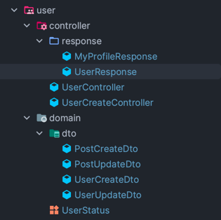

- Response DTO 는 사실상 컨트롤러의 뷰 같은 개념이라, 컨트롤러 쪽으로 이동한다.

- CreateDto 와 UpdateDto 는 현재 Request 모델이랑 구분없이 쓰고있음.  
  - service 패키지에서 참조해야하는 거라서 domain 에 있는 게 맞는 것 같다.
  - 뒤에 붙어있는 Dto 라는 이름 마음에 안 드니까 뺀다.
  
 

- [도메인 모델인 Post 가 PostCreate 과 PostUpdate 를 사용하므로 service 패키지가 아니라 domain 패키지에 두었다.](https://www.inflearn.com/questions/984157) (순환참조 방지)

 

- 기존 repository 에서 `infrastructure` 로 이름 변경 