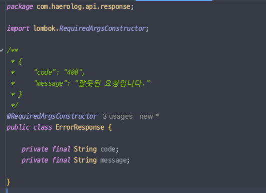
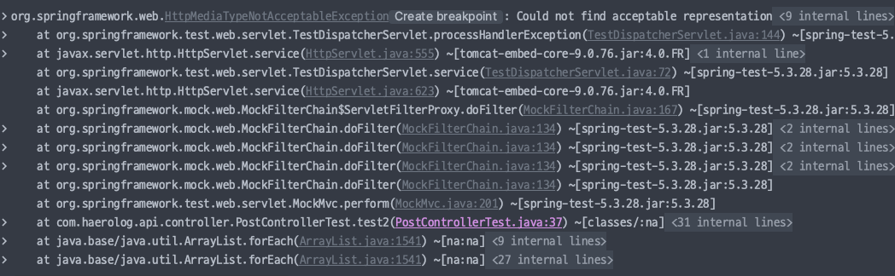
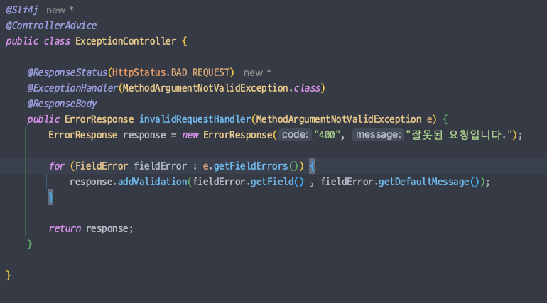

### BindingResult 를 이용한 에러 검증의 문제점

```java
@PostMapping("/posts")
public Map<String, String> post(@RequestBody @Valid PostCreateRequest params, BindingResult result) {

    if (result.hasErrors()) {
        List<FieldError> fieldErrors = result.getFieldErrors();
        FieldError firstFieldError = fieldErrors.get(0);
        String fieldName = firstFieldError.getField();
        String errorMessage = firstFieldError.getDefaultMessage();

        Map<String, String> error = new HashMap<>();
        error.put(fieldName, errorMessage);
        return error;
    }

    log.info("params={}", params);
    return Map.of();
}
```

1. 매번 메서드마다 값을 검증해야한다. 
   - 개발자가 까먹을 수 있다.
   - 검증 부분에서 버그가 발생할 여지가 높다. (휴먼 에러 등)
   - 지겹다. (간지가 안 난다.)
2. 응답값에 HashMap -> 응답 클래스를 만들어주는게 좋다.
3. 여러 개의 예외처리 힘듬.
4. 세 번 이상의 반복적인 작업은 피해야한다.
   - 코드 && 개발에 관한 모든 것 (인프라 등)
     - 👉 자동화 고려해보기

<br>


# ControllerAdvice 로 예외 처리하기

### BindingResult 가 ControllerAdvice 보다 우선순위를 갖는다


- BindingResult를 파라미터로 받는 경우 컨트롤러 메서드로 진입


- BindingResult 를 파라미터로 받지 않을 때 ExceptionHandler 동작

<br>


## ErrorResponse

```json
 {
  "code": "400",
  "message": "잘못된 요청입니다.",
  "validation": {
    "title": "값을 입력해주세요."
  }
}
```

- validation json object 를 하나 따주는 형태로 많이 진행했었음.



- 우선 code랑 message 만 응답하는 DTO를 만들 것이다.



- `HttpMediaTypeNotAcceptableException`이 발생하는데, JSON이 안 만들어져서 그런 것 같음.

<br>

### FieldError 정보 담아주기




<br>

### "code" 의 값이 꼭 필요한가?

- 필요하지 않을 수도 있다.
- `400` 만 가지고는 분기처리 하기 어렵기 때문에 `400.1`, `400.2` 처럼 사용하기도 한다.
- 정말 필요한지에 대해서는 클라이언트 개발자와 회의를 통해 정하자.