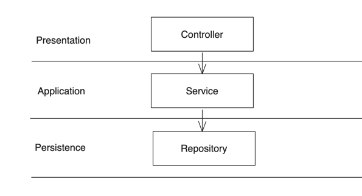
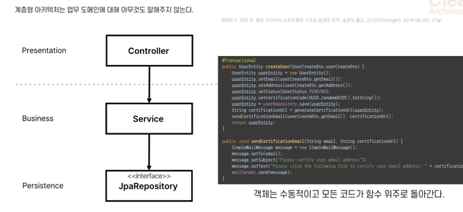
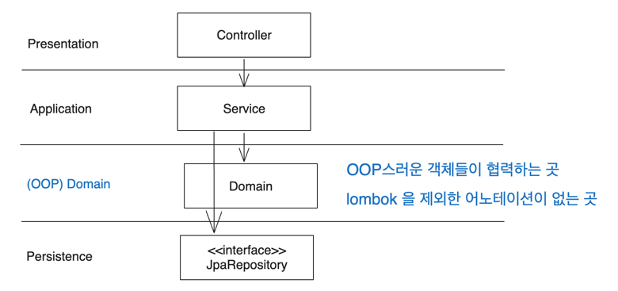
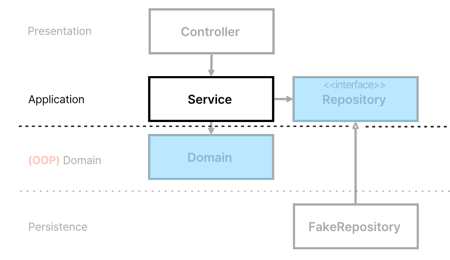
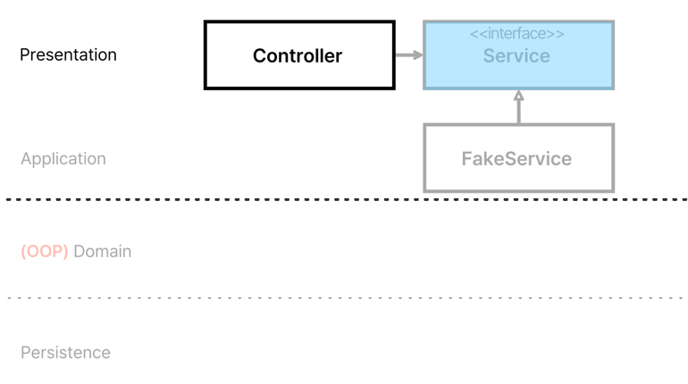

# 3.1 레이어드 아키텍처의 문제점과 해결책

## 현재 구조의 문제점 

### h2

- 모든 테스트가 h2를 필요로 한다. 
- h2를 사용하는 순간, 그 테스트는 중형 테스트가 된다.
  - 즉, 현재 시스템에 소형 테스트가 없다.
    - 테스트 한 번 한 번 돌리기가 부담스럽다.
  

- 결국 이것은 설계가 잘못되었을 확률이 높다는 뜻이다.
  - RDB 에 강결합되어있다.
  - h2 는 임베디드 DB라도 있어서 다행이지, ElasticSearch 같은 임베디드 서버가 없는 경우는 테스트 할 수도 없다.
- 지금 작성한 테스트가 실제로 테스트가 필요한 본질이 아닌 확률이 높다.

👉 위 같은 문제가 발생하는 것은 레이어드 아키텍처를 사용했기 때문이다.

 

# 레이어드 아키텍처의 문제점 

## 장점

- 레이어드 아키텍처를 사용하면 어떤 기능 개발을 해야하고, 가시적인 무언가를 빨리 만들 때 가장 쉽고 빠르다.

## 단점

### DB 주도 설계가 된다.

> 계층형 아키텍처는 데이터베이스 주도 설계를 유도한다. (중략) 모든 것이 영속성 계층을 토대로 만들어진다.
>  
> _<만들면서 배우는 클린 아키텍처>_ 

- 레이어드 아키텍처의 치명적인 단점은 바로 DB 위주의 설계를 하게 된다는 점이다. 
- 주문 시스템을 설계해야한다고 해보자
  - 아마도 JPA Entity 를 먼저 생각했을 것이다.
  - 실은, 주문 시스템에 필요한 Use case 를 파악하는게 먼저가 되어야한다.
    - 그리고 그 유즈케이스를 처리하기 위한 도메인과 도메인들의 관계를 파악하는 것이 먼저다.
  

### 동시작업 문제 발생.

- 어떤 기능을 개발한다고 했을 때 Repository가 나와야 Service 를 짤 수 있다.
- Service 가 나와야 Controller 를 짤 수 있다.

### 죽은 도메인

- 이 그림을 보고 무슨 시스템인지, 도메인이 어디에 있는지 파악할 수 없다.
- 레이어드 아키텍처를 사용하면 도메인이 눈에 안 들어온다.
- 모든 객체는 getter 와 setter 를 가지고 있고, 수동적으로 돌아갈 확률이 높다.
- 모든 코드가 함수 위주로 돌아간다.
  - 객체지향이 아니라 절차지향적인 코드가 나오게 된다.

- 결국 서비스가 사실상 모든 일을 다 처리하는 신과 같은 존재가 된다.
  - -> 이런 서비스를 Fat Service 라고 한다.

### 종합

- 레이어 아키텍처는 절차지향적인 사고를 유도하고, 테스트 하기 어려운 코드를 생산한다.

 

# 어떻게 개선할 것인가

- 도메인이란?
  - 비즈니스 문제를 해결하는 객체. 이런 객체 모델들을 도메인이라고 한다.
  - `비즈니스(Businesss)`가 해결하려는 `문제 영역(Domain)`

## 도메인을 만들자

- 도메인을 만들고, 서비스가 하던 역할을 도메인이 처리하도록 위임한다.
- 서비스는 '리포지토리에서 도메인을 가져와서 도메인한테 일을 시키는' 딱 그정도의 일만 하게 한다.

- **_실제 업무는 도메인에서 한다._**
- 이렇게 만듦으로써, 도메인 레이어는 OOP 스러운 객체들이 협력하는 공간이 된다.
- 또, 롬복을 제외한 어노테이션이 없게 만든다.
- 즉, **_도메인 엔티티와 영속성 객체를 구분하겠다._** 

## 낮은 Testability 개선하기

- 도메인은 계층간 연결된 의존성이 없으므로, Mocking을 할 필요가 없어진다.
  - 도메인은 그 자체로 순수한 자바 코드이므로 인스턴스를 만들기 쉽다. 👉 높은 Testability
- 리포지토리도 의존성이 없다.
  - 계층간 의존성이 없으므로 Mocking 필요없음.
  - JpaRepository 는 굳이 테스트 해야하나? 라는 생각을 함.
    - Repository가 쿼리를 제대로 만들어주는 지는 JPA 측에서 테스트를 하고 있을테니까.

- 도메인은 인스턴스화 하기 쉬운 반면에 JpaRepository 는 인스턴스화 하기 어려움
  - DB랑 강결합 되어있고, h2 같은 embedded DB 없이 테스트하기 어려움 (중형 테스트)

 

## 의존성 역전을 활용한 의존성 문제 해결

- 의존성 문제는 대부분 의존성 역전을 활용하면 해결된다.
- 앞으로 애플리케이션 레이어에 Repository 인터페이스를 위치시킨다.
  - 영속성 레이어에 이 Repository의 구현체를 두고, 구현체가 JpaRepository 를 사용하게 한다.

- 이렇게 함으로써 테스트할 때 Fake를 사용할 수 있다.
- 의존성 역전을 통해 서비스 레이어는 영속성 계층과의 의존관계가 놀랍도록 약해진다.
  - MySQL을 사용하다가 MongoDB로 갈아타게 되더라도, Service 코드는 전혀 영향 가지 않는다.
    - Service 에서 요구하는 구현은 Repository 구현체에서 알아서 할 것이기 때문.

 

### Repository 구현체

- RepositoryImpl 은 JpaRepository 를 사용해서 영속성 객체를 가져오고, 그것을 도메인으로 변환한다.

- Repository 는 이렇게 생겼고, 구현체에는 관심이 없다.
- 어떤 질의와 명령을 할 수 있는지 명세만 적혀져 있을 뿐이다.
  - 그 결과, **_Service 는 Repository 를 질의 했을 때, 필요한 도메인을 내려주는 녀석 정도로만 알고 있게 된다._**

 

### Controller 개선하기 

- 인스턴스화는 쉽지만, 너무 의존성이 많음 👉 의존성 역전을 사용한다.

- 서비스를 인터페이스로 만들고 서비스 구현체를 둔다.

- 그 결과 테스트할 때 Fake나 Mock을 Service 구현체로 두게 함으로써 컨트롤러는 테스트하기 쉽게 만든다.

 

# 모든 외부 연동에서도 사용가능한 DIP

- 리포지토리 뿐만 아니라, 모든 외부 연동(infrastructure)에서도 인터페이스에 의존하게 만든다. (테스트 용이성)