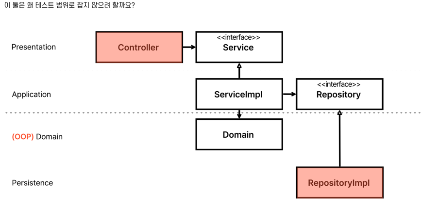
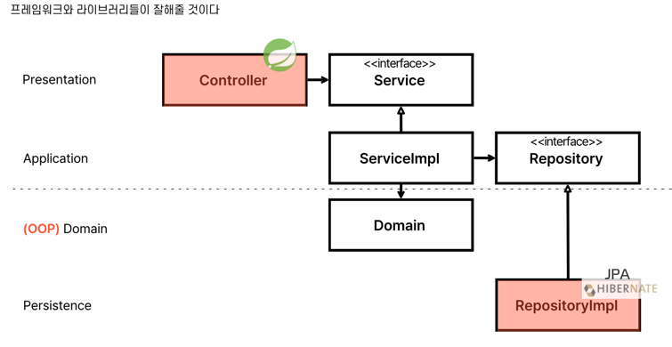
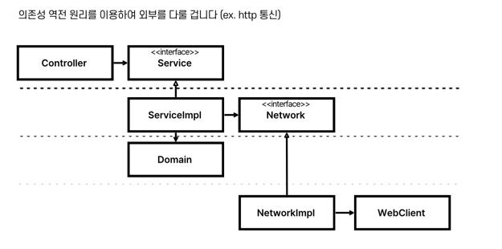
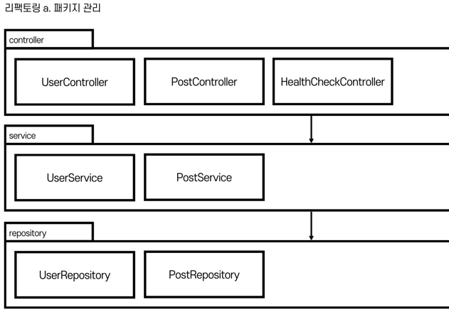
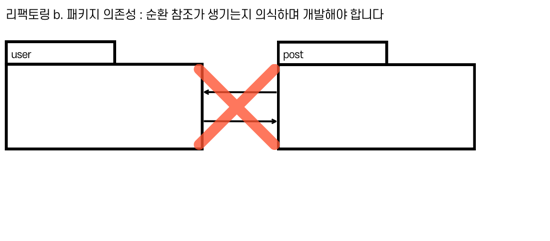
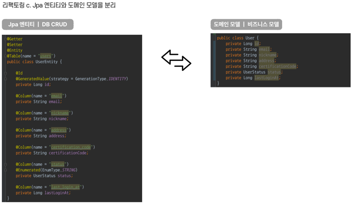
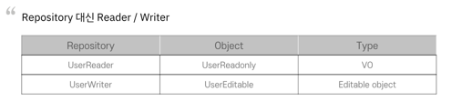

# 테스트의 범위

- 집중해야하는 것은 서비스와 도메인이다.

- 컨트롤러와 RepositoryImpl 은 테스트 해야하나 싶다.

- 스프링을 제대로 다뤘다면, 컨트롤러의 역할은 너무나 단순하다.
  1. 핸들러가 RequestBody 를 받아서,
  2. 서비스를 호출하고
  3. 응답을 내려준다.

- 주요 역할은 요청을 처리하고 응답을 내려주는 것. 
  - 이런 것들은 스프링 팀에서 알아서 잘 처리하고 있을 것이다.

- RepositoryImpl 도 마찬가지다.
  - 엔티티를 통해 CRUD 하는 것은 JPA와 Hibernate 팀에 알아서 잘 해줄 것이다.

 

###  🤔 컨트롤러랑 리포지토리 구현체를 테스트하지 않으면 커버리지가 낮아지지 않나요?

- 도메인이야말로 애플리케이션의 핵심이다.
- 즉, `ServiceImpl` 과 `Domain` 이 잘 만들어져 있어야 애플리케이션의 내적 품질이 올라간다.
  - _**이 두 곳을 테스트하는 것이 전체 애플리케이션을 테스트하는 데 있어 최소 조건이다.**_

- Jpa, Spring 테스트 안 한다고 커버리지가 낮게 나온다면 그것은 도메인이 빈약하기 때문일 확률이 높다.

 

## 의존성 역전은 왜 중요한가?

- `의존성 역전`은, 의존 관계를 약화시킨다.
- 호출자와 구현체를 독립적으로 구성하겠다는 의미이다.
- 결국 이를 통해 테스트 가능성(Testability)가 높아진다.

- Fake 등을 사용하여 h2를 대체하므로, 중형 테스트에서 소형테스트가 된다.

 

# 리팩토링

## 1. 패키지 관리

### 레이어로 분류

### 도메인을 상위에, 레이어를 하위로 분류

- 필요에 따라 분리해서 Y축 확장이 가능하다.

- 따라서, 기존 구조를 종단한다.
- 또, 영속성을 infrastructure 로 이름 변경한다.
  - 외부 연동을 하는 구현체가 repository 라는 패키지에 들어가기 애매해진다.
    - MailSender 등

 

## 2. 패키지 의존성 - 순환참조 의식

- 예제 프로젝트는 단순해서 순환참조는 없다.
- 앞으로 어떤 프로젝트든 개발하면서 패키지 의존성도 한 번 생각해봐라.
- 컴포넌트나 클래스, 넓게는 패키지까지도 참조관계가 순환하는 그림을 보고 순환참조라고 한다.
- 순환참조는 소프트웨어 공학에서 피해야할 해악이라는게 정설에 가깝다.

 

## 3. JPA 엔티티와 도메인 모델을 분리한다

ㅊ

- User라는 도메인 모델에 대응되는 UserEntity를 만들 것이고, UserEntity를 이용하여 DB에 CRUD를 할 것이다.
- 접미어로 `Entity` 용어를 붙인 것은 RDB의 Entity 에 해당하기 때문이다.
  - 만약 MongoDB 를 사용했다 `UserDocument`라고 이름을 지었을 것이다.

 

## 4. setter를 없애고 domain/vo 으로 로직 이동

- 서비스에 있는 로직들을 가능하면 도메인 엔티티로 옮긴다.
  - **_👉 그리고 도메인 엔티티를 테스트한다._**
  - 도메인은 POJO 객체이므로 테스트가 매우 쉬워진다.

 

## 5. CQRS(Command and Query Responsibility Separation)

- 명령과 질의의 책임 분리
- 메서드를 명령과 질의로 나누자. (더 넓게는 클래스까지도)

 

### 명령과 질의

- **명령(Command)**
  - _상태를 바꾸는 메소드._
  - 명령 메소드는 `void` 타입이어야 한다.
  - 편의상 명령 메소드가 종종 `return this` 하는 경우도 있는데, 이렇게 되면 안 된다.
    

- **질의(Query)**
  - _상태를 물어보는 메소드._
  - 상태만 물어보고, 객체의 상태를 바꾸진 않는다.
    - 다시 말하자면, return 타입이 void 가 아니라면 객체의 상태를 변경해선 안 된다는 뜻이다.

> **_"하나의 메소드는 명령이나 쿼리여야 하며, 두 가지 기능을 모두 가져서는 안 된다. 명령은 객체의 상태를 변경할 수 있지만, 값을 반환하지 않는다. 쿼리는 값을 반환하지만 객체를 변경하지 않는다."_** _- 마이클 C. 페더스, 레거시 코드 활용 전략 손대기 두려운 낡은 코드, 안전한 변경과 테스트 기법, 이정문, 심윤보 역, (에이콘출판사, 2018-09-28), 218p_

 

### Repository 에 CQRS 적용하기 

- Repository 에 CQRS 를 적용해서 Reader/Writer 로 구분하고, Readonly 객체와 Editable 객체로 분리해볼 것이다.