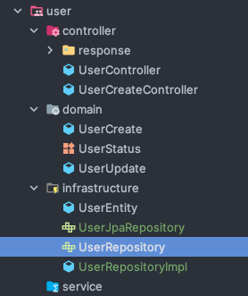
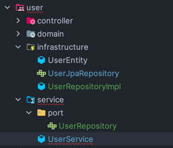
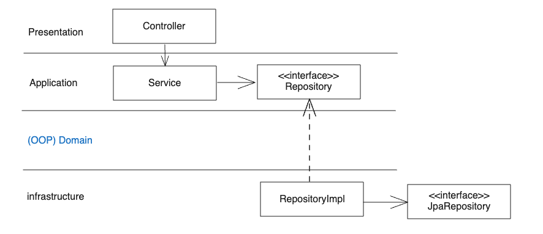
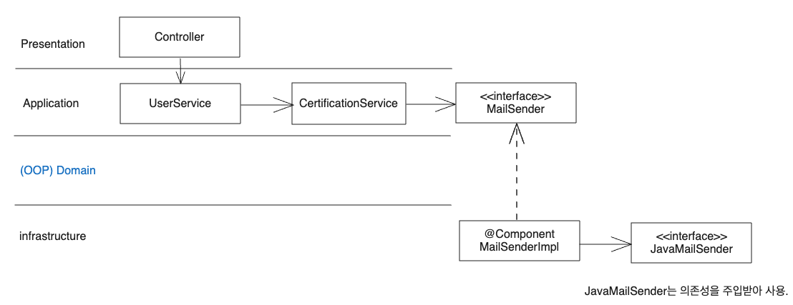
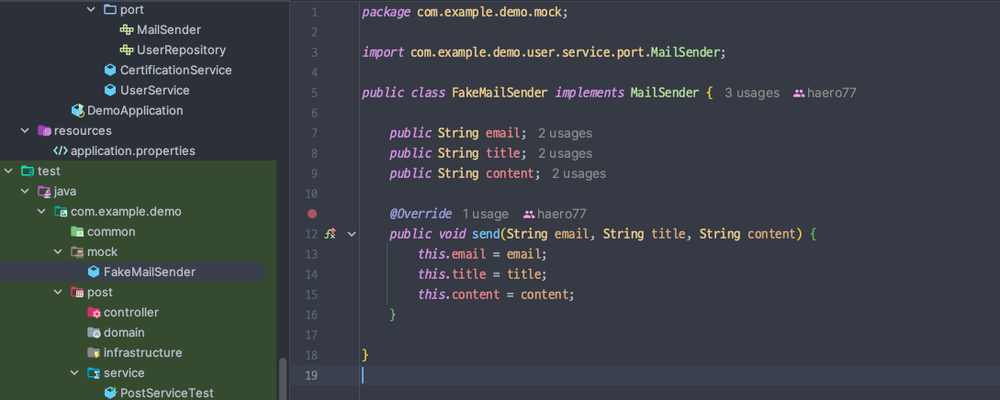

# 외부 연동을 다루는 법

- Repository 나 JavaMailSender 등 외부 연동에 의존성 역전을 사용해보자

<br>

### 확실한 네이밍

- 기존에 있는 Repository 들의 이름을 명확하게 JpaRepository로 변경한다.


<br>

## 의존성 역전을 위한 인터페이스 만들기


- RepositoryImpl 은 Repository 를 구현하고, JpaRepository 는 의존성을 주입받아 사용한다.

<br>

### Repository가 infrastucture 에 있어도 되나?



- UserRepository를 infrastructure 에 두면, 상위 모듈인 service 에서 infrastructure 인 패키지에 의존하게 되는데, 그럼 안 된다.
- UserRepository를 service 패키지에 두고, **_service 쪽에 외부 연동을 담당하는 port 패키지_** 를 만들자.



- port 패키지는 외부 연동을 담당하는 인터페이스를 위치시킨다.
  - 이제 service 는 더 이상 infrastructure 를 참조하지 않고, port 만 의존하게 된다. 

### Repository 의존성 역전



<br>

### MailSender 의존성 역전



- CertificationService 를 만들어 메일을 전송하는 책임을 위임한다.
- **_Service 가 만들어졌으니, 테스트도 만들어보자_**



- MailSender를 구현하는 FakeMailSender 를 mock 패키지 하위에 만든다.

```java
class CertificationServiceTest {

    @DisplayName("이메일과 컨텐츠가 제대로 만들어져서 보내지는지 테스트한다.")
    @Test
    void send() {
        // given
        FakeMailSender fakeMailSender = new FakeMailSender();
        CertificationService certificationService = new CertificationService(fakeMailSender);

        // when
        certificationService.send("kok202@naver.com", 1, "aaaaaaaa-aaaa-aaaa-aaaa-aaaaaaaaaaab");

        // then
        assertThat(fakeMailSender.email).isEqualTo("kok202@naver.com");
        assertThat(fakeMailSender.title).isEqualTo("Please certify your email address");
        assertThat(fakeMailSender.content).isEqualTo("Please click the following link to certify your email address: http://localhost:8080/api/users/1/verify?certificationCode=aaaaaaaa-aaaa-aaaa-aaaa-aaaaaaaaaaab");
    }

}
```

- CertificationService 는 MailSender 의존성을 필요로 한다. 구현체로 FakeMailSender 를 생성자에서 주입해준다.
- 테스트도 빠르고 쉽다.

<br>


### 🤔 여기서 드는 의문 

- 그럼 실제로 메일이 잘 전송되었는지는 어떻게 테스트 코드에서 보장하지?
  - 보장 불가능한 영역인가?
  - 테스트가 프로덕션을 완전히 커버할 수는 없는건가?