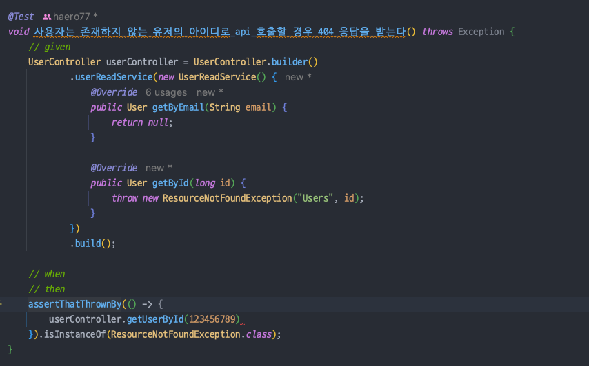

## Stub 비추천

- 사실 이렇게 stub 하는 코드는 그렇게 선호하진 않는다.
- 애초에 _"어떤 하위 클래스에 어떤 메서드가 호출되면 이런 응답을 내려줘야 한다"_ 라는 것 자체가 구현을 강제하게 된다.
  - 👉 _**책임을 위임하고 구현을 알아서 해라**_ 라는 것과는 거리가 멀어지게 된다.

## Spring의 IoC를 흉내내는 TestContainer 만들기 

