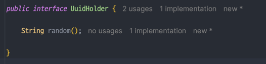

## 랜덤한 값을 의존성 주입받기

- UserCreate 을 이용하여 User 를 생성하는 테스트 코드를 다음과 같이 짜려한다.

- 문제는, `certificationCode`를 `User.from()` 으로 생성하다 보니 어떤 값이 할당되었는지 외부에서는 알 수가 없다.
  - 👉 의존성 역전을 통해 랜덤값을 주입해주자

### 의존성 역전을 위한 인터페이스 구현

- common.port 에 `UuidHolder` 를 만들고, 이것의 구현체를 common.infrastructure 에 생성한다.

- User 가 UuidHolder 구현체를 외부에서 주입받도록 변경한다. 

### 테스트 mock 객체 구현

- 인터페이스를 구현하는 테스트용 mock 객체를 구현한다. 
- 구현은 생성자에서 바로 uuid 문자열을 받도록 구현했다.

- 테스트에서는 테스트 구현체를 사용하면 되므로 테스트가 가능해진다.