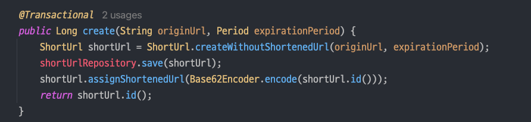

`@Transactional` 이 메서드에 있으면 update 문이 안 나가고,
클래스 단위에 있으면 update 문이 나간다. 

이 경우에는 update 문이 나간다. 

~~왜 그런지는 모르겠다;;~~

열심히 구글링한 결과 Transactional 이 프록시로 동작하기 때문에 임을 알 게 되었다.

---

**※ Reference**

- [[JPA] 변경감지 개념과 @Transactional 위치에 따른 변경감지 사용](https://beaniejoy.tistory.com/68)

---

