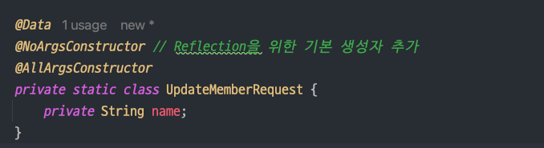

```java
Resolved [org.springframework.http.converter.HttpMessageNotReadableException:
JSON parse error: Cannot construct instance of `jpabook.jpashop.api.
MemberApi$UpdateMemberRequest` (although at least one Creator exists): cannot
deserialize from Object value (no delegate- or property-based Creator);
```

`@RequestBody` 를 이용해서 Request DTO를 생성할 때  

### 무엇이 문제였나


### 어떻게 해결했나 




### 그럼 왜 Reflection은 기본 생성자가 필요한가

### 결론 


<br>

※ References

- [[우아한테크코스] 기본 생성자가 필요한 이유 (Why the default constructor is needed) (feat. Jackson ObjectMapper + Reflection)
  ](https://da-nyee.github.io/posts/woowacourse-why-the-default-constructor-is-needed/)