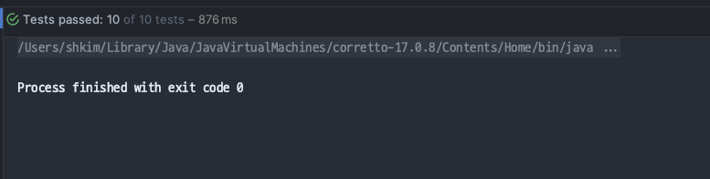
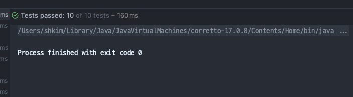

# 상황

- 의존성 주입을 잘 관리해서, `@Component` 이긴 하지만 외부 빈 의존성 없이 POJO급 객체를 만들었다.
- 생각해보니 목으로 주입할 필요가 없어서, 생성자를 이용해서 생성하도록 변경했더니 속도가 엄청 차이 났다.

# 변경 전

# 변경 후

- 0.7 초나 차이나는데, 체감되는 차이가 엄청나다.
- 이것과 관련하여 조금 더 조사해보고 포스팅 예정.
  - _"의존성 관리를 통한 테스트 실행시간 줄이기"_ 의 내용으로.