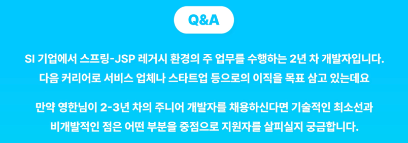

> https://www.inflearn.com/course/lecture?courseSlug=30%EB%A7%8C-%EA%B9%80%EC%98%81%ED%95%9C-%EB%9D%BC%EC%9D%B4%EB%B8%8C%EC%84%B8%EC%85%98&unitId=207090&category=questionDetail&tab=curriculum

<!-- TOC -->

* [0. 개발자의 역량](#0-개발자의-역량)
    * [JPA의 미래](#jpa의-미래)
    * [국내 개발자들의 경쟁력](#국내-개발자들의-경쟁력)
    * [도움이 되는 업무, 도움이 되지 않는 업무?](#도움이-되는-업무-도움이-되지-않는-업무)
    * [개발 권태기 극복](#개발-권태기-극복)
* [1. 채용/이직 관련](#1-채용이직-관련)
    * [신입 개발자에게 바라는 점](#신입-개발자에게-바라는-점)
        * [인상적이었던 친구](#인상적이었던-친구)
        * [최고의 친구: 정리가 된 친구](#최고의-친구-정리가-된-친구)
    * [2-3년차 주니어에게 바라는 점](#2-3년차-주니어에게-바라는-점)
        * [기본기](#기본기)
        * [내가 좋아했던 이력서](#내가-좋아했던-이력서)
        * [내가 많이 뽑은 친구들](#내가-많이-뽑은-친구들)
        * [내가 향로에게 페이스북으로 DM을 한 이유](#내가-향로에게-페이스북으로-dm을-한-이유)
    * [개발자 채용 기준](#개발자-채용-기준)
    * [성장하기 어려운 환경 속 성장하기](#성장하기-어려운-환경-속-성장하기)
        * [솔직한 조언: 적어도 본인이 스스로 빛날 수 있는 자리로 본인을 가져다 두는 정도의 노력은 해라.](#솔직한-조언-적어도-본인이-스스로-빛날-수-있는-자리로-본인을-가져다-두는-정도의-노력은-해라)
        * [향로: 영한님이 JPA를 도입하려고 했을 때 당신도 주니어 시절. 어떻게 했나?](#향로-영한님이-jpa를-도입하려고-했을-때-당신도-주니어-시절-어떻게-했나)
    * [취업을 준비하는 개발자들에게](#취업을-준비하는-개발자들에게)

<!-- TOC -->

# 0. 개발자의 역량

## JPA의 미래

## 국내 개발자들의 경쟁력

## 도움이 되는 업무, 도움이 되지 않는 업무?

## 개발 권태기 극복

# 1. 채용/이직 관련

## 신입 개발자에게 바라는 점

> 👉 **_기본기를 갖추고, 기술을 적용해보고 정리를 하자._**

### 인상적이었던 친구

- 실무에서 쓰는 기술들에 대한 기본기가 있는 분
    - Spring, JPA, DB, Java에 대한 기본 질문들
        - 이 질문들에 대해 제대로 대답을 못해도, 질문 주고 받다보면 진짜 아는지 모르는지 드러난다.

- 단순히 강의를 들은 레벨이 아니라, 그래도 자기 토이 프로젝트에 활용해봤는 친구
    - 써보면서 생각이 깊어짐.

### 최고의 친구: 정리가 된 친구

- Spring, JPA.. 등등 질문하는데 답변이 너무 깔끔하더라.
    - _"이거는 이 때 이 때 사용하고 ~~"_

- 아는 거를 간단하게 만들어보면서 써본 것 뿐만 아니라 정리까지 한 친구들이더라.

- 로드맵을 만든 것도 빅테크에서 일하는 주니어라면 이정도는 알아야한다고 생각해서 만들었음.

---

## 2-3년차 주니어에게 바라는 점

> 👉 **_기본기, 집요함을 통한 근본적인 문제 해결, 환경을 바꾸려는 노력_**

### 기본기

- 쓰는 기술에 대한 기본기
    - Spring을 쓰는 회사라면 Spring, JPA, 관계형 데이터베이스에대한 기본기
    - RDB기반의 Java 생태계
- 기본기 덕분에 실무에서 일을 시작했을 때 되게 빨리 성장할 수 있는
- 기본기외 Redis, NoSQL 등은 옵션이라고 생각.

### 내가 좋아했던 이력서

- **환경을 바꾸기 위한 노력**
    - 현재 상황이 안 좋은데, 환경을 바꾸기 위해 어떤 노력을 했는지

- **문제를 근본적으로 해결한 경험**
    - 일하다가 무슨 문제가 터졌는데 이걸 기술적으로 어떻게 해결했다.
    - **_집요하게 끝까지 파고 들어가서 문제를 근본적으로 해결하는 친구들이 있다. 👍_**
        - 플러스 많이된다. 회사에서 큰 일이 터져도 죽자사자 달려들겠구나. 끝까지 가보겠구나
    - 해결하긴 했는데 단순 구글링을 통해 덮어두듯이 해결한 경우들이 있는데 이 경우는 전혀 가산점이 안 된다.
    - **집요하게 물어 뜯고 늘어지는 것**
        - 엉뚱하게 물어 뜯는 게 아니고, 본질적인 문제를 찾아서 해결하는 것
            - 그런 경험이 여러 개 있는 친구들을 선호

### 내가 많이 뽑은 친구들

- 비슷한 환경이었는데, 되게 노력을 한게 보이는 친구들
    - 테스트라도 해보려고 노력해보고
    - 빌드도 너무 엉망이엇는데 빌드도 자동화해서 바꿔보고
    - 문제가 발생하면 진짜 집요하게 파서 문제를 해결하고,
    - 위 같은 내용을 이력서에 또 잘 적더라.
- 이런 친구들이 지금 회사도 당장 그렇게 좋지 않고, 전공자가 아니더라 할지라도
    - 집요하게 파고, 본인이 배운 것을 이용하여 지금 있는 환경을 좋은 방향으로 바꾸려고 노력하고
    - 그런 것들을 보고 가능성을 보고 뽑은 친구들은 항상 폭발적으로 성장하더라
        - 그동안 환경이 안 갖춰졌던 것. 성장할 수 있는 환경에 오니까 폭발적으로 성장.
        - 그런 친구들 나중에 리드하는 친구들도 있더라.

### 내가 향로에게 페이스북으로 DM을 한 이유

- 같은 기술 블로거가 계속 눈에 띄는데 그게 향로.
- 그 블로그를 보는데 되게 꾸준하더라
- 옛날에 썼던 글은 별로였는데, 갈수록 좋아지더라.
- 글을 보면 집요함이 보여서, 기본기가 좋다고 판단했음.

---

## 개발자 채용 기준

## 성장하기 어려운 환경 속 성장하기

> 👉 **_그대가 빛날 수 있는 곳으로 이직하라. 이직하기 위한 노력은 분명히, 반드시 해야한다._**

- 뭘 하려고 해도 주변에서 그걸 왜 하냐, 그냥 하던대로 하면 되지.
    - 예) 마이바티스 쓰면 우리 그냥 마이바티스 쓰면 되지, 옛날처럼 계속 100번 쿼리 짜고 있으면 되지, JPA라는 이상한 강의 들었구나
    - 이러면 발전이 없다. 계속 여러분도 10년 20년 그 선배처럼 살고 싶지 않을 거거든요.

- 회사라는게 놀랍게도 한 개인의 회사의 기업 문화를 바꾸는 건 거의 불가능하다.
    - 그게 바뀌는 회사는 팀이 바뀌는 회사나 그런 회사들은 적어도 내가 팀장급이 되거나 아니면 그게 바뀔 준비가 된 팀이었거나

- 설득하는데 에너지가 더 들어가더라

### 솔직한 조언: 적어도 본인이 스스로 빛날 수 있는 자리로 본인을 가져다 두는 정도의 노력은 해라.

> 👉 **_그대가 빛날 수 있는 곳으로 이직하라. 이직하기 위한 노력은 분명히, 반드시 해야한다._**

- 내가 여기서 도저히 안 되겠는데 라고 했을 때, 그것이 아니다.
- 적어도 내가 마음껏 일할 수 있게, 나 자신이 정말 즐겁게 도전할 수 있게,
    - **_그게 되는 환경으로 나를 옮길 정도의 노력은 본인이 해야한다._**

### 향로: 영한님이 JPA를 도입하려고 했을 때 당신도 주니어 시절. 어떻게 했나?

- 굉장히 어려웠고, 부딪힘도 많았다.
- 다음 회사에서 좋은 리더를 만났다.
    - 시대가 어느 땐데 옛날 기술을 쓰느냐.
    - 오히려 공부 안 하고 그러면 혼냈다.
- 나를 믿어주고, 내가 과감하게 할 때 믿고 맡겨주는 사람들이 있을 때 크게 성장하더라

- 향로:
    - 그 전에 있을 때도 영한님이 JPA 영문 자료만 있던 시절에도 실무에 도입할 만큼 이해도가 있었다.
    - 도입하기 위한 준비를 사전에 많이 해둔 것은 필요.

---

## 취업을 준비하는 개발자들에게