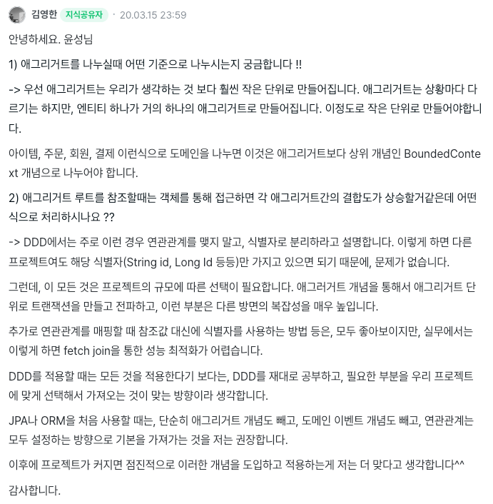
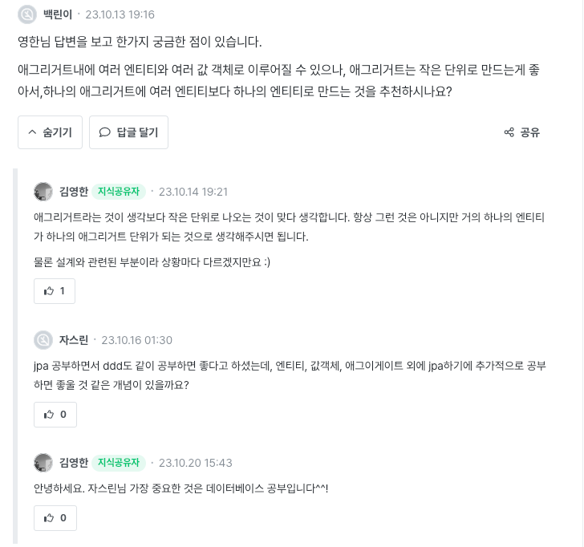

> https://www.inflearn.com/questions/27918

# 간접 참조와 직접 참조

- 애그리거트를 사용시 트랜잭션을 만들고 전파하는 등, 다른 방면의 복잡성을 높인다.
- 참조값 대신에 식별자를 사용하는 방법은 좋아보이지만 fetch join을 통한 성능 최적화가 어려움.
- JPA, ORM 처음 사용 시에는 연관관계는 모두 설정하는 방향으로하는 것을 권장

---

 

# 중요한 것은 DB 공부야

- DDD 같은 기술론 보다, 가장 중요한 것은 DB 공부 그 자체다..!