<!-- TOC -->
* [1. Java와 비교하며 배우는 Javascript 기본 문법들](#1-java와-비교하며-배우는-javascript-기본-문법들)
  * [JS에도 타입은 있다 (typeof).](#js에도-타입은-있다-typeof)
  * [상수는 'const'](#상수는-const)
  * [console.log](#consolelog)
  * [alert](#alert)
  * [`==` 과 `===`](#-과-)
    * [`!=` 과 `!==`](#-과--)
  * [배열](#배열)
    * [배열과 반복문](#배열과-반복문)
  * [함수 선언과 호출](#함수-선언과-호출)
    * [일반적인 함수 선언](#일반적인-함수-선언)
    * [함수를 변수처럼 다룰 수 있다](#함수를-변수처럼-다룰-수-있다)
    * [함수를 파라미터로 넣을 수도 있다.](#함수를-파라미터로-넣을-수도-있다-)
* [2. JSON](#2-json)
  * [Javascript Object Notation(표기법)](#javascript-object-notation표기법)
  * [직렬화 역직렬화](#직렬화-역직렬화)
* [3. XHR을 활용한 AJAX 요청 보내기](#3-xhr을-활용한-ajax-요청-보내기)
* [4. form 태그와 AJAX](#4-form-태그와-ajax)
<!-- TOC -->

# 1. Java와 비교하며 배우는 Javascript 기본 문법들

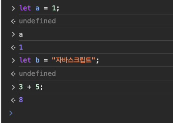

- `let b = "자바스크립트"';`라는 행위 자체에 대한 결과값은 존재하지 않으므로 `undefined`
- `3 + 5;`의 결과값은 존재하므로 `undefined`가 아니라 '8'.

## JS에도 타입은 있다 (typeof).

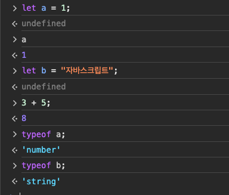


## 상수는 'const'

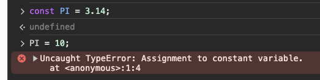

- 상수의 값을 변경하려 하면 에러가 발생.
 
## console.log

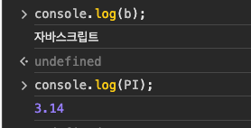

- '자바스크립트'는 `console.log(b)` 기능이 실행되어서 나타난 결과.
- `console.log(b)`는 로그를 찍는 행위를 할 뿐이지, 이 함수의 결과값 자체는 없으므로 `undefined`가 출력됨.  

## alert

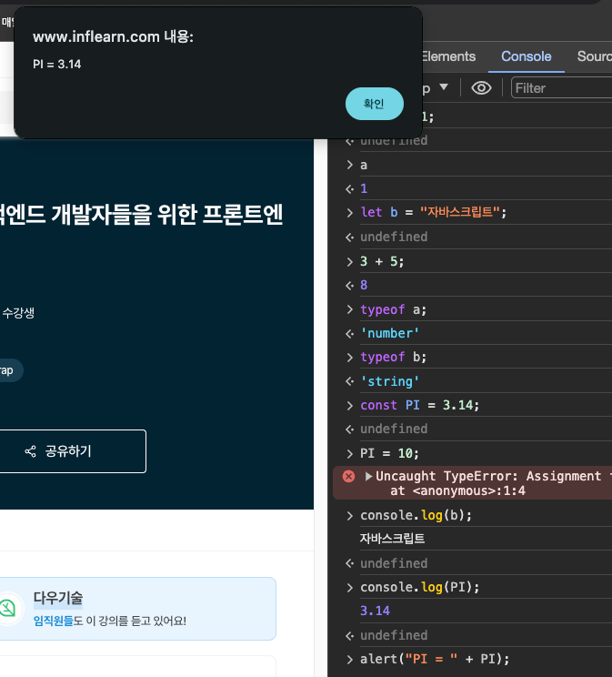

## `==` 과 `===`

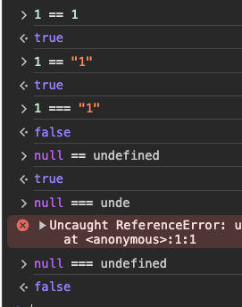

- `==` 은 Equal Operator
- `===` 은 Strict Equal Operator
  - **_가능하면 `===`를 사용하자._**

### `!=` 과 `!==`  

- `!=` <-> `==`
- `!==` <-> `===`

## 배열

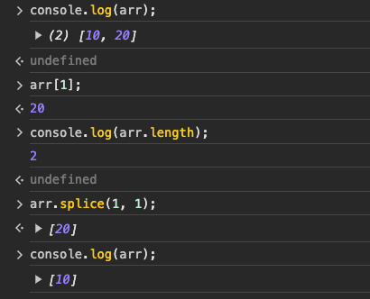

### 배열과 반복문

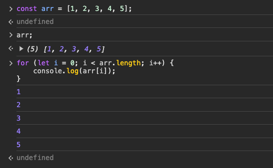

- `console.log`의 반환값이 없으므로 `undefined`.

## 함수 선언과 호출

### 일반적인 함수 선언

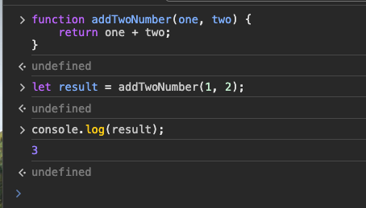

### 함수를 변수처럼 다룰 수 있다

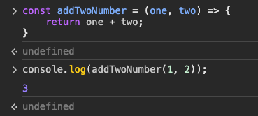

### 함수를 파라미터로 넣을 수도 있다.   

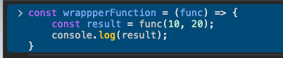

- 아직 호출은 하지 않은 상태

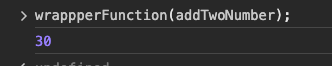

- 함수를 파라미터로 넣을 수 있다.
- js는 java와는 다르게 함수를 일급시민으로 취급한다.
  - 일급 시민: 함수를 변수처럼 취급

<br>

# 2. JSON

## Javascript Object Notation(표기법)

```json
{
  "squadName": "Super hero squad",
  "homeTown": "Metro City",
  "formed": 2016,
  "secretBase": "Super tower",
  "active": true,
  "members": [
    {
      "name": "Molecule Man",
      "age": 29,
      "secretIdentity": "Dan Jukes",
      "powers": ["Radiation resistance", "Turning tiny", "Radiation blast"]
    },
    {
      "name": "Madame Uppercut",
      "age": 39,
      "secretIdentity": "Jane Wilson",
      "powers": [
        "Million tonne punch",
        "Damage resistance",
        "Superhuman reflexes"
      ]
    },
    {
      "name": "Eternal Flame",
      "age": 1000000,
      "secretIdentity": "Unknown",
      "powers": [
        "Immortality",
        "Heat Immunity",
        "Inferno",
        "Teleportation",
        "Interdimensional travel"
      ]
    }
  ]
}

```

- JS에서 객체를 표기하는 방법을 빌려온 것이지, JS 객체와는 다르다.

## 직렬화 역직렬화

 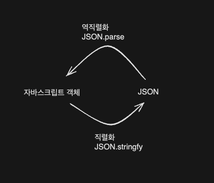

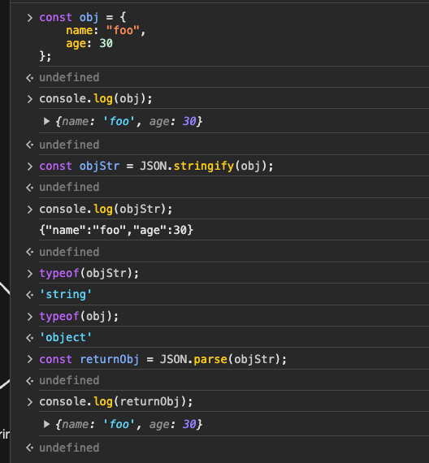


# 3. XHR을 활용한 AJAX 요청 보내기

## XHR(XMLHttpRequest)

- XHR: JS에서 AJAX 요청을 보내기 위한 내장 객체(라이브러리라고 이해)

## AJAX(Asynchronous Javascript and XML)

- **비동기**가 핵심
- AJAX를 사용하면, 웹 페이지를 새로고침 하지 않고도 서버에서 데이터를 가져와서 화면을 갱신해줄 수 있다. 👉 더 나은 사용자 경험

# 4. form 태그와 AJAX